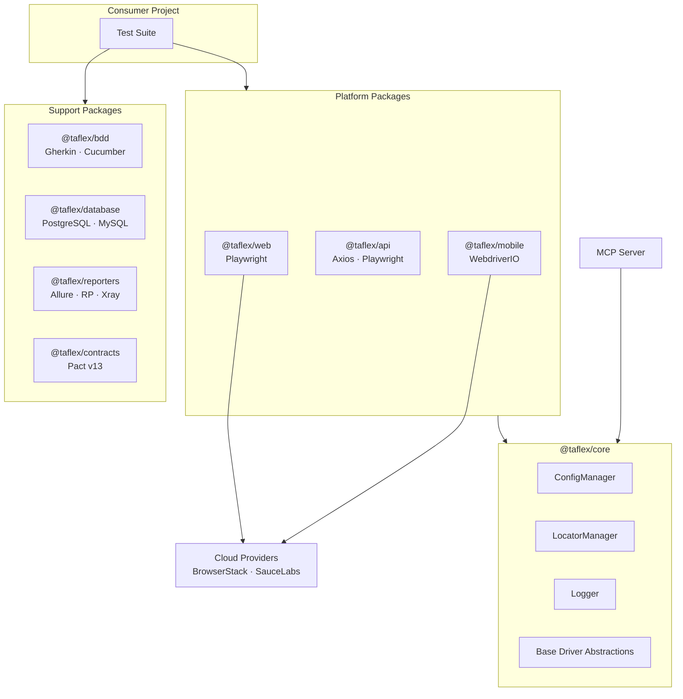
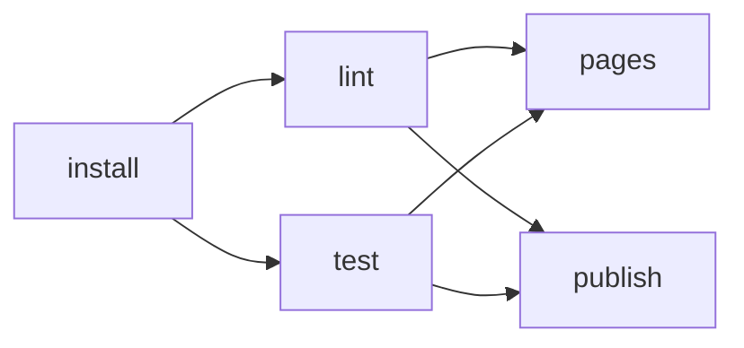

<h1 align="center">TAFLEX JS (Modular)</h1>

<div align="center">

**The Modular, Enterprise-Grade Test Automation Ecosystem.**

[](https://github.com/vinipx/taflex-js-modular/actions/workflows/ci.yml)
[](https://nodejs.org/)
[](https://playwright.dev/)
[](https://webdriver.io/)
[](https://vitest.dev/)
[](https://zod.dev/)
[](https://docs.pact.io/)
[](https://getpino.io/)
[](https://modelcontextprotocol.io)
[](https://opensource.org/licenses/ISC)

[**Explore the Docs**](https://vinipx.github.io/taflex-js-modular)

[Report Bug](https://github.com/vinipx/taflex-js-modular/issues/new) · [Request Feature](https://github.com/vinipx/taflex-js-modular/issues/new) · [Pull Requests](https://github.com/vinipx/taflex-js-modular/pulls)

</div>

---

## Why TAFLEX JS (Modular)?

**TAFLEX JS (Modular)** is an evolution of our automation engine, redesigned for high-performance and scalability using a monorepo architecture. By decoupling components into independent packages and distributing them via the **GitHub Packages**, we offer a truly plug-and-play experience for modern QA and Engineering teams.

### Key Capabilities

*   **Modular Monorepo** — Built with **npm workspaces**. Eight independent packages: `@taflex/core`, `web`, `api`, `mobile`, `bdd`, `database`, `reporters`, and `contracts`.
*   **Smart Scaffolding** — Create a custom, enterprise-ready automation project in seconds with the interactive `scaffold.sh`. Supports both **GitHub Packages** (default) and GitHub Registry sources.
*   **Unified Multi-Platform** — One framework for **Playwright** (Web), **Axios/Playwright** (API), and **WebdriverIO** (Mobile).
*   **AI-Agent Ready** — Native **MCP (Model Context Protocol)** server integration, allowing AI agents (Claude Desktop, Gemini CLI, Cursor, VS Code, OpenCode) to autonomously run and debug tests.
*   **Bulletproof Config** — Runtime environment validation using **Zod** — eliminating "undefined" errors in CI pipelines.
*   **Contract Testing** — Consumer-driven contract testing with **Pact v13** for microservices confidence.
*   **Cloud Native** — Native support for **BrowserStack**, **SauceLabs**, and **GitHub Actions** pipelines.
*   **Data-Driven** — Integrated managers for **PostgreSQL** and **MySQL** validation.
*   **Deep Visibility** — Plug-and-play reporting for **Allure**, **ReportPortal**, and **Jira Xray**.
*   **Structured Logging** — Production-grade structured logging with **Pino** and pluggable transports for reporter integration.
*   **Smart Locator Management** — Hierarchical JSON-based locator system (Global > Mode > Page) decoupling tests from DOM structure.
*   **Automated Versioning** — **Changesets** with fixed versioning — all 8 packages release in lockstep.

---

## Modular Architecture

TAFLEX JS leverages a **Package-Driven Modular Architecture**. Teams import directly from the package they need — each package provides a concrete driver and auto-registers it internally.



### Available Packages

| Package | Purpose |
| :--- | :--- |
| `@taflex/core` | Config management (Zod), locator manager, logging (Pino), and base driver abstractions. |
| `@taflex/web` | Playwright-based web automation strategy. |
| `@taflex/api` | API automation strategies (Axios & Playwright). |
| `@taflex/mobile` | WebdriverIO-based mobile automation strategy. |
| `@taflex/bdd` | First-class BDD support (Gherkin/Cucumber via playwright-bdd). |
| `@taflex/database` | SQL validation (PostgreSQL/MySQL). |
| `@taflex/reporters` | Enterprise reporting integrations (Allure, ReportPortal, Jira Xray). |
| `@taflex/contracts` | Consumer-driven contract testing with Pact. |

---

## Quick Start

### 1. Instant Scaffolding

Create your custom test project in seconds using our interactive setup script:

```bash
git clone https://github.com/vinipx/taflex-js-modular.git
cd taflex-js-modular
./scaffold.sh
```

> The scaffolder supports both **GitHub Packages** (default, enterprise) and **GitHub Registry** (open-source) distribution sources.

### 2. Framework Development

If you are contributing to the framework core:

```bash
git clone https://github.com/vinipx/taflex-js-modular.git
cd taflex-js-modular
npm ci
```

| Command | Purpose |
| :--- | :--- |
| `npm test` | Run unit tests for all packages (Vitest) |
| `npm run lint` | Run ESLint across the monorepo |
| `npm run lint:fix` | Automatically fix linting issues |
| `bash docs.sh` | Launch the Docusaurus documentation site locally |
| `npx changeset` | Create a new changeset for versioning |
| `npx changeset version` | Bump versions from pending changesets |

---

## CI/CD Pipeline (GitHub Actions)

The project uses GitHub Actions with a four-stage pipeline defined in `.github/workflows/ci.yml`:



| Stage | Job(s) | Trigger |
| :--- | :--- | :--- |
| **install** | `npm ci` + cache artifacts | Every push |
| **quality** | `lint` + `test` (parallel) | Every push |
| **pages** | Build Docusaurus, deploy to GitHub Pages | Changes to `docs/**/*` |
| **publish** | Publish all 8 packages to GitHub Packages | Version tags (`v*.*.*`) |

---

## Package Distribution & Registry Strategy

All eight `@taflex/*` packages are published to the **GitHub Packages** — a private npm registry built into GitHub. Publishing is triggered automatically by version tags (`v*.*.*`) through the CI pipeline.

### Versioning Strategy

TAFLEX uses **fixed versioning** via [Changesets](https://github.com/changesets/changesets) — all 8 packages always share the same version number and release together. This guarantees cross-package compatibility and eliminates version matrix issues.

| Aspect | Detail |
| :--- | :--- |
| **Versioning scheme** | [Semantic Versioning 2.0.0](https://semver.org/) (major.minor.patch) |
| **Version group** | Fixed — all packages bump together |
| **Changelog** | Auto-generated per package by Changesets |
| **Publish trigger** | Git tag matching `v*.*.*` → CI publish stage |

### Release Channels (Dist-Tags)

| Tag | Purpose | Install Command |
| :--- | :--- | :--- |
| `latest` | Current stable release (default) | `npm install @taflex/core` |
| `next` | Pre-release / beta for early testing | `npm install @taflex/core@next` |
| `legacy` | Previous major version maintenance patches | `npm install @taflex/core@legacy` |

### Consumer Setup

**1. Configure `.npmrc`** — point your project to the GitHub Packages:

```ini
@taflex:registry=https://npm.pkg.github.com
//npm.pkg.github.com/:_authToken=${GITHUB_TOKEN}
```

**2. Install** — add only the packages your tests need:

```bash
npm install @taflex/core @taflex/web @taflex/reporters
```

**3. Pin versions** — use exact or patch ranges for predictable CI:

```json
{
  "@taflex/core": "~1.2.0",
  "@taflex/web": "~1.2.0",
  "@taflex/reporters": "~1.2.0"
}
```

### Best Practices for Consumers

- **Pin all `@taflex` packages to the same version** — fixed versioning means mixing versions can cause compatibility issues
- **Commit `package-lock.json`** — ensures reproducible installs across machines and CI
- **Use environment variables for tokens** — never hardcode `GITHUB_TOKEN` in `.npmrc`
- **Only install what you need** — a web UI team doesn't need `@taflex/mobile`

> **Full guide:** [Registry Strategy & Best Practices](https://vinipx.github.io/taflex-js-modular/docs/architecture/registry-strategy) — covers publishing mechanics, internal dependency management, maintenance branches, rollback procedures, and team onboarding examples.

### Consumer Example

See [`examples/consumer-web-taf`](./examples/consumer-web-taf) for a working example of how to consume `@taflex/core` and `@taflex/web` packages from GitHub Packages, including `.npmrc` setup, Playwright configuration, and sample tests.

---

## AI-Agent Integration (MCP)

TAFLEX JS is an **MCP (Model Context Protocol)** host. This allows you to connect your test suite to AI assistants like **Claude Desktop**, **Gemini CLI**, **Cursor**, **VS Code (Cline/Roo Code)**, and **OpenCode**.

### Quick Connect

<details>
<summary><strong>Claude Desktop</strong></summary>

Add to your `claude_desktop_config.json`:

```json
{
  "mcpServers": {
    "taflex": {
      "command": "node",
      "args": ["/absolute/path/to/taflex-js-modular/packages/core/src/mcp/server.js"],
      "env": {
        "NODE_ENV": "development"
      }
    }
  }
}
```

</details>

<details>
<summary><strong>Gemini CLI</strong></summary>

Via command line:

```bash
gemini mcp add taflex node /absolute/path/to/taflex-js-modular/packages/core/src/mcp/server.js
```

Or add to `.gemini/settings.json`:

```json
{
  "mcpServers": {
    "taflex": {
      "command": "node",
      "args": ["/absolute/path/to/taflex-js-modular/packages/core/src/mcp/server.js"]
    }
  }
}
```

</details>

<details>
<summary><strong>Cursor</strong></summary>

1. Go to **Settings > Features > MCP**
2. Click **+ Add New MCP Server**
3. Name: `taflex`
4. Type: `command`
5. Command: `node /absolute/path/to/taflex-js-modular/packages/core/src/mcp/server.js`

</details>

<details>
<summary><strong>VS Code (Cline / Roo Code)</strong></summary>

Add to the extension's MCP configuration:

```json
{
  "mcpServers": {
    "taflex": {
      "command": "node",
      "args": ["/absolute/path/to/taflex-js-modular/packages/core/src/mcp/server.js"]
    }
  }
}
```

</details>

<details>
<summary><strong>OpenCode</strong></summary>

Add to `opencode.json` (global in `~/.config/opencode/` or per-project):

```json
{
  "mcpServers": {
    "taflex": {
      "type": "local",
      "command": "node",
      "args": ["/absolute/path/to/taflex-js-modular/packages/core/src/mcp/server.js"],
      "enabled": true
    }
  }
}
```

</details>

### Available MCP Tools

| Tool | Description |
| :--- | :--- |
| `list_specs` | Scan and return all `.spec.js` and `.feature` files |
| `list_locators` | List locator JSON files by mode (web/mobile) |
| `get_locator` | Retrieve a specific locator file for inspection |
| `run_test` | Trigger Playwright execution and return STDOUT/STDERR |

### Available MCP Resources

| Resource | Description |
| :--- | :--- |
| `taflex://config/current` | Resolved framework config (secrets masked) |
| `taflex://reports/latest` | JSON summary of the most recent test execution |

> For detailed setup instructions and use cases, see the [MCP Integration Guide](https://vinipx.github.io/taflex-js-modular/docs/guides/mcp-integration).

---

## Contributing

We welcome contributions! Whether it's a bug fix, a new package, or a documentation improvement, please check our [Contributing Guidelines](https://vinipx.github.io/taflex-js-modular/docs/contributing/guidelines).

---

<div align="center">
Built with care by the TAFLEX Community.
<br/>
<i>Modular. Reliable. Future-Proof.</i>
</div>
