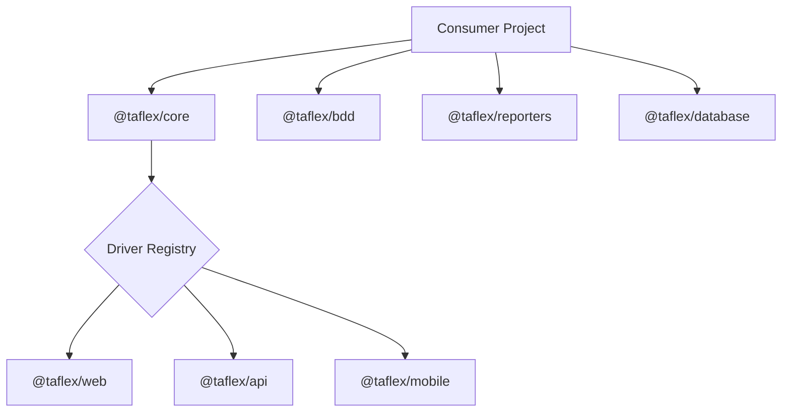

<h1 align="center">🚀 TAFLEX JS (Modular)</h1>

<div align="center">

**The Modular, Enterprise-Grade Automation Ecosystem.**

[](https://github.com/vinipx/taflex-js-modular/actions)
[](https://nodejs.org/)
[](https://playwright.dev/)
[](https://webdriver.io/)
[](https://vitest.dev/)
[](https://zod.dev/)
[](https://modelcontextprotocol.io)
[](https://opensource.org/licenses/ISC)

[**Explore the Docs »**](https://vinipx.github.io/taflex-js-modular/)

[Report Bug](https://github.com/vinipx/taflex-js-modular/issues) • [Request Feature](https://github.com/vinipx/taflex-js-modular/issues) • [Community Discussion](https://github.com/vinipx/taflex-js-modular/discussions)

</div>

---

## 💎 Why TAFLEX JS (Modular)?

**TAFLEX JS (Modular)** is an evolution of our automation engine, redesigned for high-performance and scalability using a monorepo architecture. By decoupling components into independent packages, we offer a truly plug-and-play experience for modern QA and Engineering teams.

### ✨ Key Capabilities

*   🧩 **Modular Monorepo**: Built with **npm workspaces**. Use independent packages for `@taflex/core`, `web`, `api`, `mobile`, `bdd`, `database`, and `reporters`.
*   🏗️ **Smart Scaffolding**: Create a custom, enterprise-ready automation project in seconds with our interactive `scaffold.sh`.
*   🌐 **Unified Multi-Platform**: One framework for Playwright (Web), Axios/Playwright (API), and WebdriverIO (Mobile).
*   🤖 **AI-Agent Ready**: Native **MCP (Model Context Protocol)** server integration, allowing AI agents to autonomously run and debug tests.
*   🛡️ **Bulletproof Config**: Runtime environment validation using **Zod**—eliminating "undefined" errors in CI pipelines.
*   ☁️ **Cloud Native**: Native support for **BrowserStack**, **SauceLabs**, and **GitHub Actions**.
*   🗄️ **Data-Driven**: Integrated managers for **PostgreSQL** and **MySQL** validation.
*   📊 **Deep Visibility**: Plug-and-play reporting for **Allure**, **ReportPortal**, and **Jira Xray**.

---

## 🏛️ Modular Architecture

TAFLEX JS leverages a **Strategy Pattern** within a Monorepo structure. This allows high cohesion and low coupling across all automation layers.



### 📦 Available Packages
| Package | Purpose |
| :--- | :--- |
| `@taflex/core` | Config management, driver registry, and base abstractions. |
| `@taflex/web` | Playwright-based web automation strategy. |
| `@taflex/api` | API automation strategies (Axios & Playwright). |
| `@taflex/mobile` | WebdriverIO-based mobile automation strategy. |
| `@taflex/bdd` | First-class BDD support (Gherkin/Cucumber). |
| `@taflex/database` | SQL validation (PostgreSQL/MySQL). |
| `@taflex/reporters` | Enterprise reporting integrations (Allure, RP, Xray). |
| `@taflex/contracts` | Consumer-driven contract testing with Pact. |

---

## 🚀 Quick Start

### 1. Instant Scaffolding
Create your custom test project in seconds using our interactive setup script:

```bash
git clone https://github.com/vinipx/taflex-js-modular.git
cd taflex-js-modular
./scaffold.sh
```

### 2. Framework Development
If you are contributing to the framework core, use these commands:

| Command | Purpose |
| :--- | :--- |
| `npm test` | Run unit tests for all packages (Vitest) |
| `npm run lint` | Run ESLint across the monorepo |
| `npm run lint:fix` | Automatically fix linting issues |
| `bash docs.sh` | Launch the Docusaurus documentation site locally |

---

## 🤖 AI-Agent Integration (MCP)

TAFLEX JS is an **MCP (Model Context Protocol)** host. This allows you to connect your test suite to AI assistants like Claude Desktop, Gemini CLI, or Cursor.

### Quick Connect

#### Claude Desktop
Add this to your `claude_desktop_config.json`:
```json
{
  "mcpServers": {
    "taflex": {
      "command": "node",
      "args": ["/absolute/path/to/taflex-js-modular/packages/core/src/mcp/server.js"]
    }
  }
}
```

#### Gemini CLI
Add this to your `.gemini/settings.json`:
```json
{
  "mcpServers": {
    "taflex": {
      "command": "node",
      "args": ["/absolute/path/to/taflex-js-modular/packages/core/src/mcp/server.js"]
    }
  }
}
```

> 💡 For more detailed setup instructions, check our [MCP Integration Guide](https://vinipx.github.io/taflex-js-modular/docs/guides/mcp-integration).

---

## 🤝 Contributing

We welcome contributions! Whether it's a bug fix, a new package, or a documentation improvement, please check our [Contributing Guidelines](https://vinipx.github.io/taflex-js-modular/docs/contributing/guidelines).

---

<div align="center">
Built with ❤️ by <a href="https://github.com/vinipx">vinipx</a> and the TAFLEX Community.
<br/>
<i>Modular. Reliable. Future-Proof.</i>
</div>
