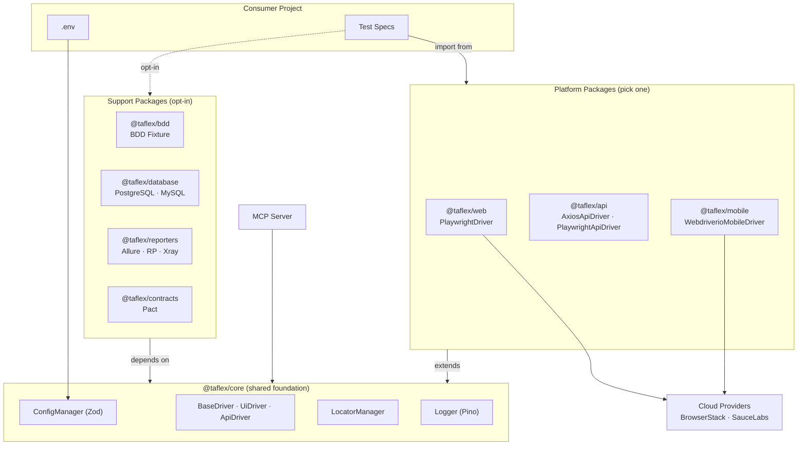
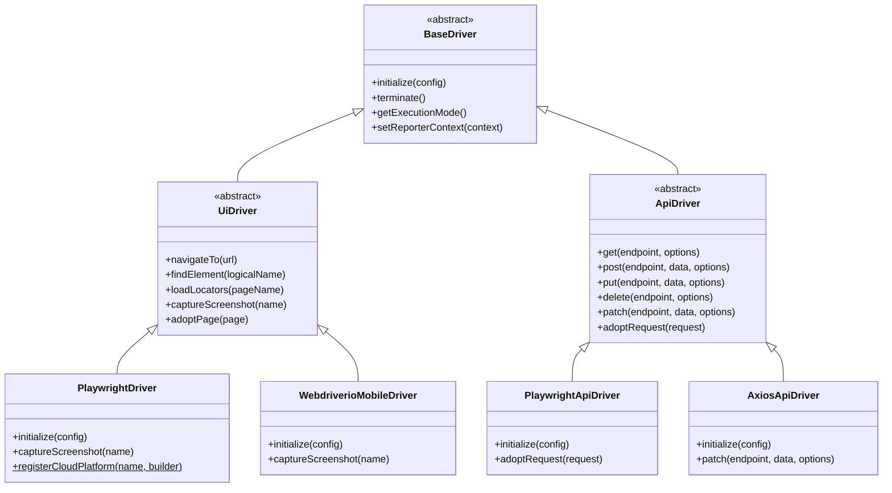

# Enterprise Architecture Overview

TAFLEX JS is an enterprise-grade test automation framework engineered for scale, maintainability, and rapid onboarding. Built on modern JavaScript (ESM) and adhering to strict software design patterns, it serves as the foundational quality layer for teams testing Web, API, Mobile, and Microservices ecosystems.

## The Modular Approach (Monorepo)

The defining characteristic of TAFLEX JS is its **Strict Plugin Architecture**. Instead of a monolithic framework that forces teams to download dependencies for tools they don't use (like downloading Appium when you only need API testing), the framework is split into isolated packages within a Monorepo.

### The Packages Ecosystem

The repository is structured into distinct, purpose-built NPM packages:

- **`@taflex/core`**: The foundation. Provides the abstract driver hierarchy (`BaseDriver`, `UiDriver`, `ApiDriver`), `ConfigManager` (Zod), `LocatorManager`, and structured logging via Pino. Consumer projects receive core transitively — each platform package re-exports everything from core.
- **`@taflex/web`**: Web automation driver, powered by Playwright. Provides `PlaywrightDriver` for browser-based testing with local and cloud grid support.
- **`@taflex/api`**: Dual API drivers — `PlaywrightApiDriver` for integrated flows with shared browser authentication, and `AxiosApiDriver` for high-performance standalone API testing with Vitest.
- **`@taflex/mobile`**: Mobile automation driver, powered by WebdriverIO and Appium. Supports local emulators and cloud real-device grids.
- **`@taflex/database`**: Database managers for test data orchestration (PostgreSQL, MySQL).
- **`@taflex/contracts`**: Consumer-driven contract testing integration powered by Pact.
- **`@taflex/reporters`**: Enterprise reporting integrations for Xray (Jira), ReportPortal, and Allure.
- **`@taflex/bdd`**: BDD testing support with Playwright-BDD integration. Provides an auto-provisioning `driver` fixture that selects the correct driver at runtime based on `EXECUTION_MODE`, enabling mode-agnostic Gherkin scenarios.

**Business Value:** Teams compose their framework with a single install. An API-only team runs `npm install @taflex/api` — they get the API drivers, configuration management, and logging, without downloading Playwright browsers or Appium dependencies.

## Core Architectural Principles

Our architecture is guided by four pillars that solve the common pain points of large-scale test automation:

| Principle | Implementation | Business Value |
|-----------|----------------|----------------|
| **📦 Strict Modularity** | Delivered as isolated npm workspaces (`@taflex/core`, `@taflex/web`, etc.). | Teams only install and load the dependencies they need, keeping pipelines lean and fast. |
| **🧩 Unified Driver Hierarchy** | A `BaseDriver` interface extended by `UiDriver` and `ApiDriver` ensures consistent contracts across all engines (Playwright, WDIO, Axios). | Test logic is fully decoupled from the underlying tools. Write once, run anywhere. |
| **📄 Externalized Locators** | Selectors are abstracted into a hierarchical JSON system (Page > Mode > Global). | QA Engineers can update locators without touching code; AI Agents can easily parse them. |
| **🛡️ Type-Safe Configuration** | Composed **Zod** schemas validate environment variables at startup. | Fail-fast execution: prevents tests from running with missing or invalid credentials. |

## System Context Diagram

The following diagram illustrates the framework's layered architecture. Platform packages extend core's base classes and re-export core's utilities, so consumers only need to import from the package they chose.

### How Consumers Use the Framework

The `npm install` command **is** the mode selection. Each platform package re-exports everything from `@taflex/core`, so a single import gives consumers the driver, configuration manager, logger, and everything else they need.

| Team Profile | Install | Import | Driver |
|:---|:---|:---|:---|
| **Web UI Testing** | `npm install @taflex/web` | `import { PlaywrightDriver, configManager } from '@taflex/web'` | `new PlaywrightDriver()` |
| **API Testing** | `npm install @taflex/api` | `import { AxiosApiDriver, configManager } from '@taflex/api'` | `new AxiosApiDriver()` |
| **Mobile Testing** | `npm install @taflex/mobile` | `import { WebdriverioMobileDriver, configManager } from '@taflex/mobile'` | `new WebdriverioMobileDriver()` |
| **BDD (any mode)** | `npm install @taflex/web @taflex/bdd` | `import { test } from '@taflex/bdd'` | Auto-provisioned via `EXECUTION_MODE` |

## Deep Dive: Key Subsystems

### 1. Package-Driven Selection
Because the framework is split into independent npm packages, the `npm install` command **is** the mode selection. A team that installs `@taflex/web` gets `PlaywrightDriver` and imports it directly — no factory or runtime configuration needed. Each package auto-registers its drivers in the internal `DriverRegistry` on import, which is used by the `@taflex/bdd` package for mode-agnostic BDD testing.

### 2. Driver Layer (Unified Hierarchy)
Test scripts never interact directly with Playwright or WebdriverIO. Instead, they interact with the unified `BaseDriver` interface (extended by `UiDriver` and `ApiDriver`).

**Advantage:** If the industry shifts to a new tool tomorrow, we simply write a new driver in a new package (e.g., `@taflex/cypress`). Your thousands of test specs remain untouched because they code against the `UiDriver` interface, not the engine itself.

### 3. Zod-Powered Configuration Validation
As frameworks scale, configuration drift is a major cause of flaky CI pipelines. TAFLEX JS utilizes **Zod** to enforce strict runtime boundaries. Each module (`@taflex/web`, `@taflex/api`) exports its own Zod schema (e.g., `WebConfigSchema`). The `configManager` merges all registered schemas and validates the `.env` file before a single test executes. If a variable is missing or incorrectly typed, the execution fails fast before spinning up any expensive infrastructure.

### 4. Smart Locator Management
Selectors are notorious for causing maintenance overhead. Our `LocatorManager` loads JSON files in a strict fallback hierarchy, merging them at runtime:
1. `global.json` (Shared components like Headers/Footers)
2. `{mode}/common.json` (Mode-specific, e.g., web/common.json)
3. `{mode}/{page}.json` (Highly specific to a feature)

This structure ensures maximum reusability. When a test calls `driver.findElement('login_btn')`, the `LocatorManager` resolves the physical selector (e.g., `button[type="submit"]`) from the cached JSON, keeping the test code completely decoupled from DOM structure.

### 5. Shared Cloud Configuration (CloudConfigSchema)
Cloud platform settings (`CLOUD_PLATFORM`, `CLOUD_USER`, `CLOUD_KEY`, `OS`, `OS_VERSION`) are defined once in `@taflex/core` as `CloudConfigSchema`. Both `@taflex/web` and `@taflex/mobile` extend this shared schema rather than declaring their own copies. This prevents schema collision when both packages are registered in the same project, ensuring a single source of truth for cloud-related environment variables.

## AI-Native Capabilities

TAFLEX JS is future-proofed with a built-in **Model Context Protocol (MCP)** server. This architectural choice exposes the framework's state, configuration, and locators directly to AI Agents (like Claude Desktop or IDE assistants).

Agents can:
- **Discover:** Read the locator hierarchy and suggest fixes for broken tests.
- **Execute:** Trigger specific specs to validate changes.
- **Analyze:** Parse the standard JSON reports to provide natural language failure summaries.

For more details on integrating AI, refer to the [MCP Integration Guide](../guides/mcp-integration.md).
