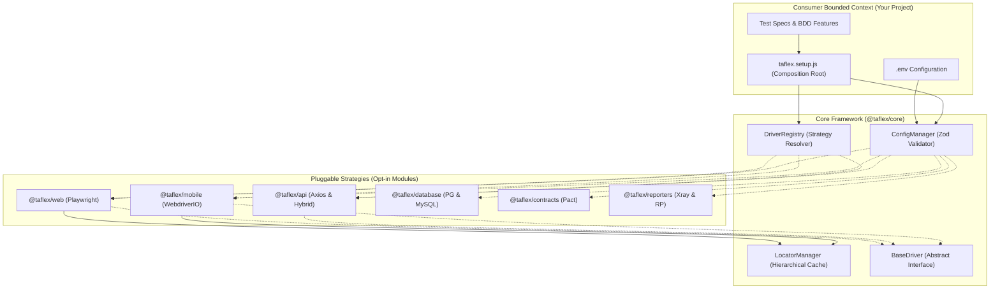
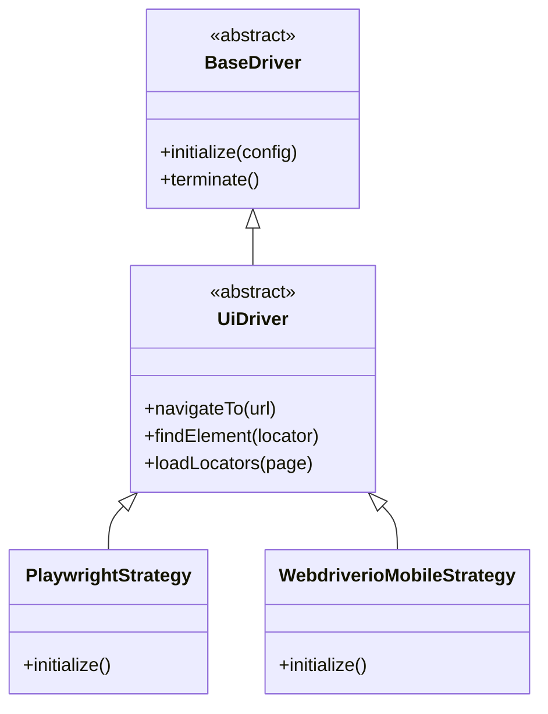

# Enterprise Architecture Overview

TAFLEX JS is an enterprise-grade test automation framework engineered for scale, maintainability, and rapid onboarding. Built on modern JavaScript (ESM) and adhering to strict software design patterns, it serves as the foundational quality layer for teams testing Web, API, Mobile, and Microservices ecosystems.

## The Modular Approach (Monorepo)

The defining characteristic of TAFLEX JS is its **Strict Plugin Architecture**. Instead of a monolithic framework that forces teams to download dependencies for tools they don't use (like downloading Appium when you only need API testing), the framework is split into isolated packages within a Monorepo.

### The Packages Ecosystem

The repository is structured into distinct, purpose-built NPM packages:

- **`@taflex/core`**: The engine of the framework. It contains the `DriverRegistry`, `LocatorManager`, `ConfigManager` (Zod), and the abstract base classes (`BaseDriver`, `UiDriver`, `ApiDriver`). **Every consumer project must install this.**
- **`@taflex/web`**: The Web automation strategy, powered by Playwright.
- **`@taflex/api`**: The Dual API strategy, providing both Playwright (hybrid) and Axios (specialized) drivers.
- **`@taflex/mobile`**: The Mobile automation strategy, powered by WebdriverIO and Appium.
- **`@taflex/database`**: Database managers for test data orchestration (PostgreSQL, MySQL).
- **`@taflex/contracts`**: Consumer-driven contract testing integration powered by Pact.
- **`@taflex/reporters`**: Enterprise reporting integrations for Xray (Jira), ReportPortal, and Allure.

**Business Value:** Teams compose their framework dynamically. An API-only team installs `@taflex/core` and `@taflex/api`, keeping their CI/CD pipelines incredibly fast and lightweight.

## Core Architectural Principles

Our architecture is guided by four pillars that solve the common pain points of large-scale test automation:

| Principle | Implementation | Business Value |
|-----------|----------------|----------------|
| **📦 Strict Modularity** | Delivered as isolated npm workspaces (`@taflex/core`, `@taflex/web`, etc.). | Teams only install and load the dependencies they need, keeping pipelines lean and fast. |
| **🧩 Strategy Pattern** | A unified `AutomationDriver` interface resolves to specific engine implementations at runtime (Playwright, WDIO, Axios) via the `DriverRegistry`. | Test logic is fully decoupled from the underlying tools. Write once, run anywhere. |
| **📄 Externalized Locators** | Selectors are abstracted into a hierarchical JSON system (Page > Mode > Global). | QA Engineers can update locators without touching code; AI Agents can easily parse them. |
| **🛡️ Type-Safe Configuration** | Composed **Zod** schemas validate environment variables at startup. | Fail-fast execution: prevents tests from running with missing or invalid credentials. |

## System Context Diagram

The following diagram illustrates how consumer projects compose the framework dynamically at runtime:

## Deep Dive: Key Subsystems

### 1. The Composition Root (`taflex.setup.js`)
Because of the modular architecture, TAFLEX JS uses a Composition Root pattern. When a new team scaffolds a project, a `taflex.setup.js` file is generated. This file acts as the central registry where the project dictates *which* modules and schemas it requires to function. This ensures that the core engine only attempts to load what is explicitly registered.

### 2. Driver Layer (Strategy Pattern)
The core of the framework is the `DriverRegistry`. Test scripts never interact directly with Playwright or WebdriverIO. Instead, they interact with the unified `BaseDriver` interface (extended by `UiDriver` and `ApiDriver`).

**Advantage:** If the industry shifts to a new tool tomorrow, we simply write a new strategy adapter in a new package (e.g., `@taflex/cypress`). Your thousands of test specs remain untouched because they code against the `UiDriver` interface, not the engine itself.

### 3. Zod-Powered Configuration Validation
As frameworks scale, configuration drift is a major cause of flaky CI pipelines. TAFLEX JS utilizes **Zod** to enforce strict runtime boundaries. Each module (`@taflex/web`, `@taflex/api`) exports its own Zod schema (e.g., `WebConfigSchema`). The `configManager` merges these schemas (based on what was registered in the Composition Root) and validates the `.env` file before a single test executes. If a variable is missing or incorrectly typed, the execution fails fast before spinning up any expensive infrastructure.

### 4. Smart Locator Management
Selectors are notorious for causing maintenance overhead. Our `LocatorManager` loads JSON files in a strict fallback hierarchy, merging them at runtime:
1. `global.json` (Shared components like Headers/Footers)
2. `{mode}/common.json` (Mode-specific, e.g., web/common.json)
3. `{mode}/{page}.json` (Highly specific to a feature)

This structure ensures maximum reusability. When a test calls `driver.findElement('login_btn')`, the `LocatorManager` resolves the physical selector (e.g., `button[type="submit"]`) from the cached JSON, keeping the test code completely decoupled from DOM structure.

## AI-Native Capabilities

TAFLEX JS is future-proofed with a built-in **Model Context Protocol (MCP)** server. This architectural choice exposes the framework's state, configuration, and locators directly to AI Agents (like Claude Desktop or IDE assistants).

Agents can:
- **Discover:** Read the locator hierarchy and suggest fixes for broken tests.
- **Execute:** Trigger specific specs to validate changes.
- **Analyze:** Parse the standard JSON reports to provide natural language failure summaries.

For more details on integrating AI, refer to the [MCP Integration Guide](../guides/mcp-integration.md).
