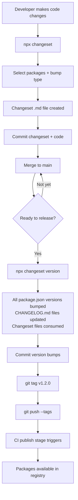
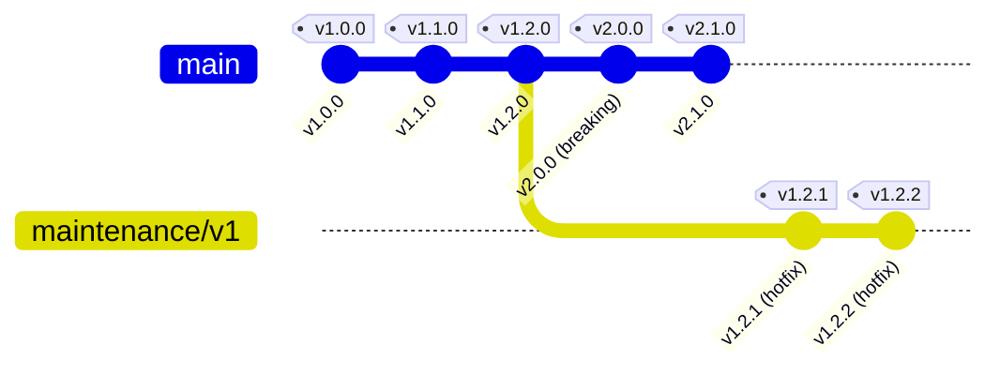

# Registry Strategy & Best Practices

This guide provides a **strategic overview** of how TAFLEX JS uses the GitHub Packages to distribute modular packages, how versioning works, and how teams should adopt and consume the framework. For operational setup steps (authentication, `.npmrc` configuration, troubleshooting), see the [Package Registry](../guides/package-registry.md) guide.

---

## Why GitHub Packages?

TAFLEX JS distributes eight scoped `@taflex/*` npm packages through the **GitHub Packages** — a private npm registry built into GitHub.

### Strategic Rationale

| Factor | GitHub Packages | Public npm Registry | Self-Hosted (Verdaccio, Nexus) |
| :--- | :--- | :--- | :--- |
| **Access control** | Built-in — uses existing GitHub roles and permissions | Requires npm org + paid teams plan | Separate user management system |
| **CI/CD integration** | Native — `GITHUB_TOKEN` provides automatic auth in Actions | Requires storing npm tokens as secrets | Requires additional token management |
| **Infrastructure** | Zero — comes with GitHub, no extra services | External dependency | Must provision, maintain, and scale servers |
| **Audit trail** | Package versions tied to git tags and pipeline runs | Limited to npm audit log | Depends on implementation |
| **Network** | Stays within corporate network boundary | Requires outbound internet access | Internal, but another service to manage |
| **Cost** | Included in GitHub plan | Free for public, paid for private orgs | Server + maintenance costs |

### Pros

- **Single platform** — source code, CI/CD, package registry, and documentation all live on GitHub
- **No extra credentials** — developers already have GitHub accounts; no separate npm account needed
- **Automatic CI authentication** — workflows use `GITHUB_TOKEN` with zero configuration
- **Scoped access** — packages inherit the project's visibility; private projects = private packages
- **Traceability** — every published version links back to a git tag and a successful CI workflow

### Cons

- **GitHub dependency** — if GitHub is down, packages cannot be installed (mitigated by `npm cache` and lock files)
- **Cross-organization sharing** — sharing packages across different GitHub orgs requires PATs with `read:packages` scope
- **No public discovery** — packages are not searchable on npmjs.com (intentional for enterprise, but a consideration)
- **Rate limits** — large organizations with many CI jobs may need to monitor GitHub API rate limits

---

## How It Works

The diagram below shows the end-to-end flow from code change to package consumption:

```mermaid
flowchart LR
    subgraph Maintainers["Framework Maintainers"]
        A[Code change] --> B[Create changeset]
        B --> C[Merge to main]
        C --> D["Run: changeset version"]
        D --> E["Tag: v1.2.0"]
        E --> F[Push tag]
    end

    subgraph CI["GitHub Actions Pipeline"]
        F --> G[install]
        G --> H[lint + test]
        H --> I["publish stage"]
        I --> J["npm publish\n(all 8 packages)"]
    end

    subgraph Registry["GitHub Packages"]
        J --> N[("Package\nRegistry")]
    end

    subgraph Consumers["Consuming Teams"]
        N --> O["npm install @taflex/*"]
        O --> P[Team TAF project]
    end
```



### Publishing Mechanics

The CI publish stage runs `npm publish` for each package. A common misconception is that packages must be published in a specific "dependency order" — this is **not the case**.

`npm publish` simply creates a tarball and uploads it to the registry. It does **not** resolve or install dependencies during publish. Dependency resolution happens later, on the **consumer side**, when they run `npm install`. By that time, all packages are already in the registry.

The current CI script publishes packages sequentially in a loop:

```
core → web → api → mobile → bdd → database → reporters → contracts
```

This ordering is a simplification — not a technical requirement. All packages could be published in parallel for faster CI runs. What matters is that **all packages are published before any consumer runs `npm install`**, which is naturally guaranteed since publish happens within a single CI job.

### Registry Configuration Hierarchy

Understanding how npm resolves the target registry is important:

| Priority | Source | Applies To |
| :--- | :--- | :--- |
| **1 (highest)** | `.npmrc` file | Both `npm publish` and `npm install` |
| **2** | `publishConfig` in `package.json` | Only `npm publish` |
| **3** | npm defaults | `registry.npmjs.org` |

In the GitHub Actions publish workflow, the `setup-node` action with `registry-url: https://npm.pkg.github.com` automatically configures `.npmrc` for GitHub Packages. The `NODE_AUTH_TOKEN` environment variable is set to `${{ secrets.GITHUB_TOKEN }}` for authentication.

:::caution publishConfig vs .npmrc
The `.npmrc` file with `@taflex:registry=https://npm.pkg.github.com` is the single source of truth for registry routing. If someone accidentally runs `npm publish` locally without proper `.npmrc` configuration, it won't publish to the public npm registry as long as the `.npmrc` is in place.
:::

---

## How Internal Dependencies Are Published

### The `"*"` Specifier

Inside the monorepo, packages that depend on `@taflex/core` use the wildcard version specifier:

```json
{
  "dependencies": {
    "@taflex/core": "*"
  }
}
```

During local development, npm workspaces resolve `"*"` to the local workspace copy of `@taflex/core`. However, when `npm publish` creates the tarball, the `"*"` is published **as-is** — npm does not rewrite plain `"*"` to an actual version number.

This means consumers installing `@taflex/web` will see `"@taflex/core": "*"` in the resolved dependency tree, which npm resolves to the `latest` version on the registry.

### Why This Works (With Fixed Versioning)

Because all 8 packages are in a **fixed version group** (see [Versioning Strategy](#versioning-strategy)), they are always published simultaneously at the same version. When a consumer installs `@taflex/web@1.2.0`, the `"*"` dependency resolves to `@taflex/core@1.2.0` (since that's the latest available). The fixed group ensures compatibility.

### The `workspace:` Protocol (Recommended Improvement)

A more robust approach is to use npm's `workspace:` protocol instead of `"*"`:

```json
{
  "dependencies": {
    "@taflex/core": "workspace:^"
  }
}
```

Unlike `"*"`, the `workspace:` protocol **is** rewritten by npm during publish:
- `"workspace:*"` → `"1.2.0"` (exact version)
- `"workspace:^"` → `"^1.2.0"` (caret range)
- `"workspace:~"` → `"~1.2.0"` (tilde range)

This gives consumers a concrete version range instead of a wildcard, providing better protection against accidental breaking upgrades. This is the recommended approach for future releases.

---

## Versioning Strategy

### Semantic Versioning

All packages follow [Semantic Versioning 2.0.0](https://semver.org/):

| Bump | When | Example | Impact on Consumers |
| :--- | :--- | :--- | :--- |
| **Patch** (`x.y.Z`) | Bug fixes, internal refactors, doc updates | `1.2.0 → 1.2.1` | Safe to upgrade — no API changes |
| **Minor** (`x.Y.0`) | New features, new config options, new exports | `1.2.0 → 1.3.0` | Safe to upgrade — backward compatible |
| **Major** (`X.0.0`) | Breaking changes (removed exports, changed signatures) | `1.3.0 → 2.0.0` | Requires migration — review changelog |

### Fixed Version Group

TAFLEX uses the **fixed** versioning strategy via [Changesets](https://github.com/changesets/changesets). All eight packages **always share the same version number**:

```
@taflex/core      → 1.2.0
@taflex/web       → 1.2.0
@taflex/api       → 1.2.0
@taflex/mobile    → 1.2.0
@taflex/bdd       → 1.2.0
@taflex/database  → 1.2.0
@taflex/reporters → 1.2.0
@taflex/contracts → 1.2.0
```

**Why fixed versioning?**

- **Simplicity** — consumers only need to track one version number
- **Guaranteed compatibility** — `@taflex/core@1.3.0` and `@taflex/web@1.3.0` are always tested and released together
- **No version matrix** — eliminates the risk of incompatible combinations like `core@1.2.0` + `web@1.4.0`

### Changesets and Internal Dependencies

The changesets configuration includes `"updateInternalDependencies": "patch"`. This setting controls what happens when an internal dependency (like `@taflex/core`) gets a version bump:

- If `@taflex/core` bumps, all packages that depend on it also receive at least a patch bump
- With the current `"*"` specifier, the wildcard already matches any version, so the specifier itself is not rewritten
- If migrated to `"workspace:^"`, changesets would produce concrete ranges like `"^1.2.0"` in the published packages — giving consumers explicit version constraints

### Release Workflow



---

## Managing Multiple Versions

### Dist-Tags

npm dist-tags allow you to publish packages under named channels beyond the default `latest`:

| Tag | Purpose | Who Uses It |
| :--- | :--- | :--- |
| `latest` | Current stable release (default when running `npm install`) | All teams in production |
| `next` | Pre-release or upcoming version for early testing | Teams that opt-in to beta testing |
| `legacy` | Previous major version receiving maintenance patches | Teams that haven't migrated to the new major yet |

#### Publishing with dist-tags

```bash
# Publish a beta version under the "next" tag
npm publish --tag next

# Publish a maintenance patch under the "legacy" tag
npm publish --tag legacy
```

#### Installing from a dist-tag

```bash
# Get the latest stable (default behavior)
npm install @taflex/core

# Get the upcoming beta
npm install @taflex/core@next

# Get the latest v1.x maintenance release
npm install @taflex/core@legacy
```

### Pre-Release Versions

Changesets supports pre-release mode for beta/RC cycles:

```bash
# Enter pre-release mode
npx changeset pre enter beta

# Create changesets and version as normal
npx changeset
npx changeset version
# → versions become 2.0.0-beta.0, 2.0.0-beta.1, etc.

# Exit pre-release mode when stable
npx changeset pre exit
npx changeset version
# → versions become 2.0.0
```

Pre-release versions should always be published under the `next` dist-tag so that `npm install @taflex/core` continues to install the stable release.

### Maintaining a Previous Major Version

When a new major version ships (e.g., `v2.0.0`), teams still on `v1.x` may need critical patches:



**Workflow:**

1. Create a maintenance branch from the last v1.x tag: `git checkout -b maintenance/v1 v1.2.0`
2. Cherry-pick or apply the fix
3. Create changeset, version, tag, and push

:::note CI Enhancement Needed
The current CI publish job does not automatically apply dist-tags. To support maintenance branches, add tag detection logic to `.github/workflows/ci.yml`:

```yaml
- name: Determine dist-tag
  id: dist-tag
  run: |
    TAG="${GITHUB_REF_NAME}"
    if echo "$TAG" | grep -qE "^v1\."; then
      echo "tag=--tag legacy" >> "$GITHUB_OUTPUT"
    elif echo "$TAG" | grep -qE "beta|alpha|rc"; then
      echo "tag=--tag next" >> "$GITHUB_OUTPUT"
    else
      echo "tag=" >> "$GITHUB_OUTPUT"
    fi
- name: Publish packages
  env:
    NODE_AUTH_TOKEN: ${{ secrets.GITHUB_TOKEN }}
  run: |
    for pkg in core web api mobile bdd database reporters contracts; do
      cd packages/${pkg}
      npm publish ${{ steps.dist-tag.outputs.tag }}
      cd ../..
    done
```

Until this is implemented, maintainers must pass `--tag legacy` manually or adjust the workflow for maintenance releases.
:::

### Rollback & Recovery

If a bad version is published:

| Action | When to Use | How |
| :--- | :--- | :--- |
| **Deprecate** | Version has bugs but isn't dangerous | `npm deprecate @taflex/core@1.2.0 "Use >= 1.2.1 — fixes critical config bug"` |
| **Unpublish** | Version must be completely removed (use sparingly) | `npm unpublish @taflex/core@1.2.0` — GitHub allows this within a configurable window |
| **Publish a patch** | Preferred approach — fix forward | Create a changeset, bump patch, publish `1.2.1` |

**Recommended recovery process:**

1. **Communicate immediately** — notify consuming teams via the agreed channel (Slack, email)
2. **Fix forward** — publish a corrected patch version as quickly as possible
3. **Deprecate the bad version** — so consumers see a warning if they install it
4. **Only unpublish as a last resort** — unpublishing can break consumers who already have it in their lock files

### Version Pinning — Recommendations for Consumers

| Strategy | Syntax | Use When |
| :--- | :--- | :--- |
| **Exact** | `"1.2.0"` | Maximum stability — CI pipelines, production test suites |
| **Patch range** | `"~1.2.0"` | Want automatic bug fixes but no new features |
| **Minor range** | `"^1.2.0"` | Want new features automatically — less common in test automation |

:::tip Recommendation
Use **exact versions** or **patch ranges** (`~`) for test automation projects. Predictability matters more than auto-updating in TAFs — an unexpected new feature in a framework dependency could change test behavior.
:::

---

## Best Practices

### For Framework Maintainers

| Practice | Details |
| :--- | :--- |
| **Always create a changeset** | Every PR with user-facing changes must include a changeset file. CI can enforce this with a `changeset status` check. |
| **Follow semver strictly** | Removing an export or changing a function signature is a **major** bump, even if it seems minor. Consumers depend on API stability. |
| **Publish only from CI** | Never `npm publish` from a local machine. The CI pipeline ensures tests pass before publishing. |
| **Keep the `files` field tight** | Only include `src/` and `index.js` in published tarballs. Exclude tests, configs, and docs to keep package size small. |
| **Verify before publishing** | Run `npm pack --dry-run` locally to inspect what would be included in the tarball. Catch accidentally included secrets, tests, or large files before they reach the registry. |
| **Test cross-package compatibility** | The root `npm test` runs all workspace tests. Always run the full suite before tagging a release. |
| **Tag consistently** | Use `v<major>.<minor>.<patch>` format (e.g., `v1.2.0`). The CI publish stage regex depends on this pattern. |

### For Consuming Teams

| Practice | Details |
| :--- | :--- |
| **Pin all `@taflex` packages to the same version** | Fixed versioning means all packages are released together. Mixing versions (e.g., `core@1.2.0` + `web@1.3.0`) can cause compatibility issues. |
| **Use a lock file** | Always commit `package-lock.json`. It ensures reproducible installs across machines and CI. |
| **Don't install unnecessary packages** | Only add the modules your tests actually use. A web UI team doesn't need `@taflex/mobile`. |
| **Set up `.npmrc` per project** | Avoid global `.npmrc` changes. Project-level `.npmrc` keeps registry config portable and explicit. |
| **Use environment variables for tokens** | Never hardcode tokens in `.npmrc`. Use `${GITHUB_TOKEN}` and set the variable in your shell or CI. |
| **Use scope-based routing** | GitHub Packages uses a single registry URL (`https://npm.pkg.github.com`) — no project ID needed. All `@taflex/*` packages resolve automatically through scope-based routing. |
| **Subscribe to the changelog** | Watch the TAFLEX repository on GitHub to get notified of new releases. Review the changelog before upgrading. |

---

## Team Onboarding Examples

The sections below show complete project setups for different team profiles. Each example includes the `.npmrc`, `package.json`, and a sample test file.

### Prerequisites (All Teams)

- **Node.js** >= 20
- A **GitHub Personal Access Token** with `read:packages` scope (for local development)

### Web UI Testing Team

```ini title=".npmrc"
@taflex:registry=https://npm.pkg.github.com
//npm.pkg.github.com/:_authToken=${GITHUB_TOKEN}
```

```json title="package.json"
{
  "name": "my-web-taf",
  "version": "1.0.0",
  "type": "module",
  "scripts": {
    "test": "npx playwright test",
    "test:headed": "npx playwright test --headed"
  },
  "dependencies": {
    "@taflex/core": "~1.0.0",
    "@taflex/web": "~1.0.0",
    "@taflex/reporters": "~1.0.0"
  },
  "devDependencies": {
    "@playwright/test": "^1.50.0"
  }
}
```

```javascript title="tests/login.spec.js"
import { test, expect } from '@playwright/test';
import { configManager } from '@taflex/core';
import { PlaywrightDriver } from '@taflex/web';

// Load and validate environment configuration
configManager.load();

test.describe('Login Flow', () => {
  let driver;

  test.beforeEach(async ({ page }) => {
    driver = new PlaywrightDriver();
    await driver.adoptPage(page);
    await driver.navigateTo(configManager.get('BASE_URL') + '/login');
  });

  test('should login with valid credentials', async ({ page }) => {
    const username = await driver.findElement('username_input');
    const password = await driver.findElement('password_input');
    const loginBtn = await driver.findElement('login_button');

    await username.fill('testuser');
    await password.fill('password123');
    await loginBtn.click();

    await expect(page).toHaveURL(/dashboard/);
  });
});
```

### API Testing Team

```json title="package.json"
{
  "name": "my-api-taf",
  "version": "1.0.0",
  "type": "module",
  "scripts": {
    "test": "vitest run"
  },
  "dependencies": {
    "@taflex/core": "~1.0.0",
    "@taflex/api": "~1.0.0"
  },
  "devDependencies": {
    "vitest": "^4.0.0"
  }
}
```

```javascript title="tests/users-api.spec.js"
import { describe, it, expect, beforeAll } from 'vitest';
import { configManager } from '@taflex/core';
import { AxiosApiDriver } from '@taflex/api';

const api = new AxiosApiDriver();

beforeAll(async () => {
  configManager.load();
  await api.initialize({
    apiBaseUrl: configManager.get('API_BASE_URL'),
    timeout: 10000,
  });
});

describe('Users API', () => {
  it('should return a list of users', async () => {
    const response = await api.get('/api/users');
    expect(response.status()).toBe(200);

    const data = await response.json();
    expect(data).toBeInstanceOf(Array);
  });

  it('should create a new user', async () => {
    const response = await api.post('/api/users', {
      name: 'Test User',
      email: 'test@example.com',
    });
    expect(response.status()).toBe(201);

    const data = await response.json();
    expect(data.id).toBeDefined();
  });
});
```

### BDD Testing Team

```json title="package.json"
{
  "name": "my-bdd-taf",
  "version": "1.0.0",
  "type": "module",
  "scripts": {
    "test": "npx playwright test"
  },
  "dependencies": {
    "@taflex/core": "~1.0.0",
    "@taflex/web": "~1.0.0",
    "@taflex/bdd": "~1.0.0",
    "@taflex/reporters": "~1.0.0"
  },
  "devDependencies": {
    "@playwright/test": "^1.50.0",
    "playwright-bdd": "^8.0.0"
  }
}
```

### Mobile Testing Team

```json title="package.json"
{
  "name": "my-mobile-taf",
  "version": "1.0.0",
  "type": "module",
  "scripts": {
    "test": "npx wdio run wdio.conf.js"
  },
  "dependencies": {
    "@taflex/core": "~1.0.0",
    "@taflex/mobile": "~1.0.0"
  },
  "devDependencies": {
    "webdriverio": "^9.0.0"
  }
}
```

### Contract Testing Team

```json title="package.json"
{
  "name": "my-contract-taf",
  "version": "1.0.0",
  "type": "module",
  "scripts": {
    "test": "vitest run",
    "test:pact": "vitest run --reporter=verbose"
  },
  "dependencies": {
    "@taflex/core": "~1.0.0",
    "@taflex/api": "~1.0.0",
    "@taflex/contracts": "~1.0.0"
  },
  "devDependencies": {
    "vitest": "^4.0.0"
  }
}
```

### CI/CD for Consuming Projects

Add this to your project's `.github/workflows/ci.yml` to authenticate against the TAFLEX registry:

```yaml title=".github/workflows/ci.yml"
name: Tests
on:
  push:
    branches: [main]
  pull_request:
    branches: [main]

jobs:
  test:
    runs-on: ubuntu-latest
    steps:
      - uses: actions/checkout@v4
      - uses: actions/setup-node@v4
        with:
          node-version: '20'
          registry-url: https://npm.pkg.github.com
      - run: npm ci
        env:
          NODE_AUTH_TOKEN: ${{ secrets.GITHUB_TOKEN }}
      - run: npm test
```

:::caution Cross-Repository Package Access
By default, `GITHUB_TOKEN` can only access packages within the same repository. For cross-repository access, the consuming project needs a Personal Access Token (PAT) with `read:packages` scope stored as a repository secret.
:::

---

## Checking Available Versions

```bash
# List all published versions (with .npmrc configured)
npm view @taflex/core versions

# Check the latest version
npm view @taflex/core version

# See full package metadata
npm view @taflex/core
```

---

## Further Reading

- [Package Registry — Setup & Troubleshooting](../guides/package-registry.md) — operational guide for authentication, `.npmrc` configuration, and common issues
- [Architecture Overview](./overview.md) — how the modular plugin architecture enables selective package adoption
- [Changesets Documentation](https://github.com/changesets/changesets) — the versioning tool used by TAFLEX
- [GitHub Packages npm Registry Docs](https://docs.github.com/en/packages/working-with-a-github-packages-registry/working-with-the-npm-registry) — official GitHub documentation
