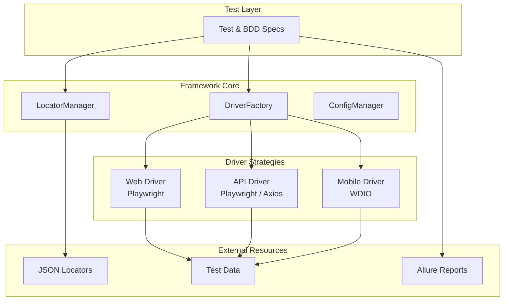

# TAFLEX JS

**Enterprise Test Automation Framework**

[](https://github.com/vinipx/taflex-js/actions)
[](https://github.com/vinipx/taflex-js/releases)
[](https://opensource.org/licenses/MIT)
[](https://nodejs.org)

---

## 🎯 What is TAFLEX JS?

TAFLEX JS is a **unified, enterprise-grade test automation framework** designed for testing Web, API, and Mobile applications using a single codebase. Migrated from the original Java-based architecture, it leverages modern Node.js (ESM), Playwright, and WebdriverIO to deliver fast, reliable, and maintainable automation.

### ✨ Key Highlights

| Feature | Description |
|---------|-------------|
| 🚀 **Quick Setup** | Modern npm-based workflow with automated setup and comprehensive guides. |
| 🧩 **Strategy Pattern** | Runtime driver resolution between platforms. Native BDD support via Gherkin. |
| 📄 **Hierarchical Locators** | All selectors stored in JSON files with Page > Mode > Global inheritance model. |
| 🛡️ **Type-Safe Config** | Environment variables are strictly validated at runtime using **Zod**. |
| 🗄️ **Database Integration** | Native support for PostgreSQL and MySQL query orchestration. |
| 📊 **Modern Reporting** | Integrated Allure reports and Playwright's native HTML reporter. |

---

## 🚀 Quick Start

Get up and running in 3 simple steps:

### 1. Clone and Setup

```bash
# Clone the repository
git clone https://github.com/vinipx/taflex-js.git
cd taflex-js

# Run the automated setup
./setup.sh
```

### 2. Configure Environment

The `setup.sh` script creates a `.env` file for you. Simply update it with your settings:

```bash
# Update with your specific credentials
nano .env
```

### 3. Run Your First Test

```bash
# Run all tests
npm test

# Run unit tests
npm run test:unit
```

---

## 🏗️ Architecture Overview



---

## 💻 Code Example

### Web Test

```javascript
import { test, expect } from '../fixtures.js';

test('should login successfully', async ({ driver }) => {
    // Navigate using unified driver
    await driver.navigateTo('https://the-internet.herokuapp.com/login');
    
    // Load page-specific locators
    await driver.loadLocators('login');

    // Use platform-agnostic element API
    await (await driver.findElement('username_field')).fill('tomsmith');
    await (await driver.findElement('password_field')).fill('SuperSecretPassword!');
    await (await driver.findElement('login_button')).click();

    // Fluent assertions
    const flashMessage = await driver.findElement('flash_message');
    expect(await flashMessage.getText()).toContain('You logged into a secure area!');
});
```

---

## 🎯 Who Should Use TAFLEX JS?

| Role | Benefits |
|------|----------|
| **QA Engineers & Testers** | Low-code locator management · High-level unified API · Automatic retries & screenshots · Beautiful reports. |
| **Developers** | Modern ESM codebase · Strategy pattern extensibility · Zod validation · Fast Vitest suite. |
| **Managers** | Unified stack for Web/API/Mobile · Reduced tech debt · Detailed dashboards · High execution ROI. |
| **DevOps Engineers** | Docker-ready · Seamless GitHub Actions integration · Parallel execution by default. |

---

## 🤝 Contributing

We welcome contributions! Please see our [Contributing Guidelines](./contributing/guidelines.md) for details.

## 📄 License

TAFLEX JS is licensed under the [MIT License](https://opensource.org/licenses/MIT).

---

**Happy Testing! 🚀**
